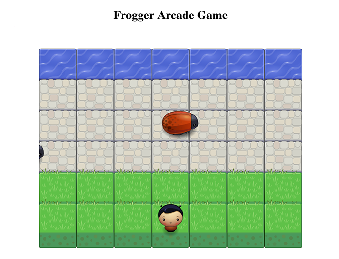
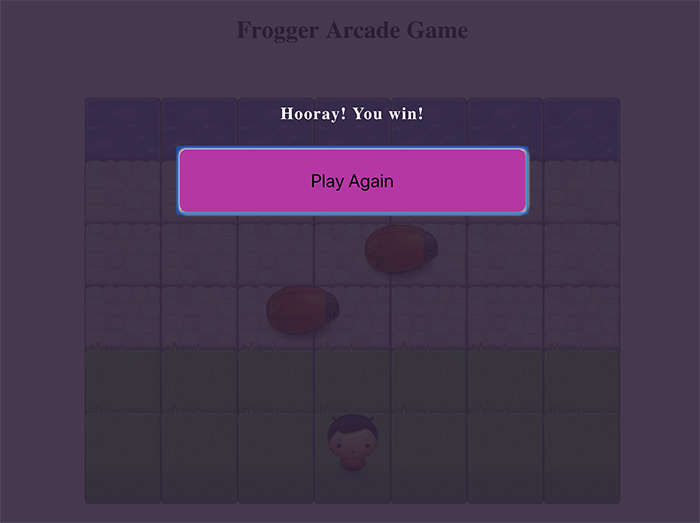
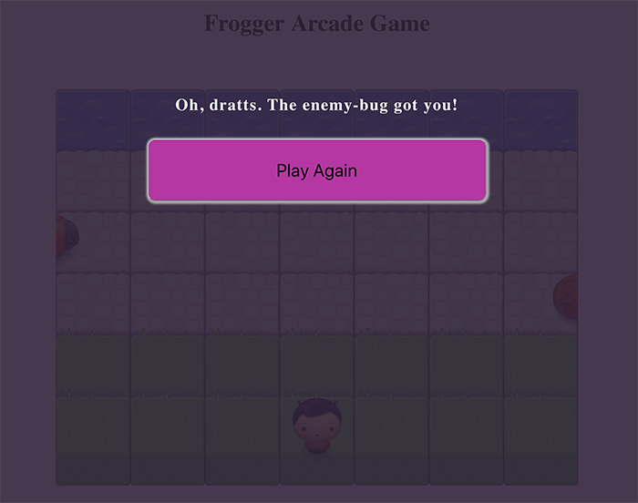

# Frogger Arcade Game
##### Project for the *Front-End Web Developer Nanodegree*

#### Introduction

**Title**: Frogger Arcade

by Rebecca Hanlon

In *Frogger Arcade*, the user tries to cross the path to the water without colliding into the giant LadyBugs which are moving at varying speeds.  Use the up, down, right and left arrows to navigate around obsticles and Ladybugs to the water.

Click [here](#game-interface) to see pictures of the game interface.

##### Start-up and Playing Directions
- Click the `index.html` to open in a browser.
- Move the arrow keys to move the player.
    - up arrow - moves forward, toward the water
    - down arrow - moves downward back to the grass
    - right arrow - moves to the right
    - left arrow - moves to the left
- Game ends when the player collides with the Ladybug.

##### Technical Components
- JavaScript (ECMAScript 6)
- CSS and HTML

##### Articles and Tutorials
**notes**:

Used the following tutorials, articles and docs while building this app.

- 2D Collision Detection [article](http://blog.sklambert.com/html5-canvas-game-2d-collision-detection#d-collision-detection)

- Tutorial Request: FEND Project 3 Arcade Game - Walk Through, by Ryan Waite [video](https://www.youtube.com/watch?v=XEVnMgYblGc&index=3&list=PLKC17wty6rS1XVZbRlWjYU0WVsIoJyO3s).
This video helped with structuring some of the prototypes, helped me to see the components put together for the project, sample of Math.random

- w3schools web docs
    - [Game Canvas](https://www.w3schools.com/graphics/game_canvas.asp)
    - [onClick Event](https://www.w3schools.com/jsref/event_onclick.asp)

- MDN web docs
    - 2d Breakout Game Using Pure Javascript [intro docs](https://developer.mozilla.org/en-US/docs/Games/Tutorials/2D_Breakout_game_pure_JavaScript)
    - Set up wall boundries [see docs](https://developer.mozilla.org/en-US/docs/Games/Tutorials/2D_Breakout_game_pure_JavaScript/Bounce_off_the_walls)

#### Future Features
- Add a scoring system
- Add sound efx
- Add some 'Treasures' for additional points

#### Game Interface

